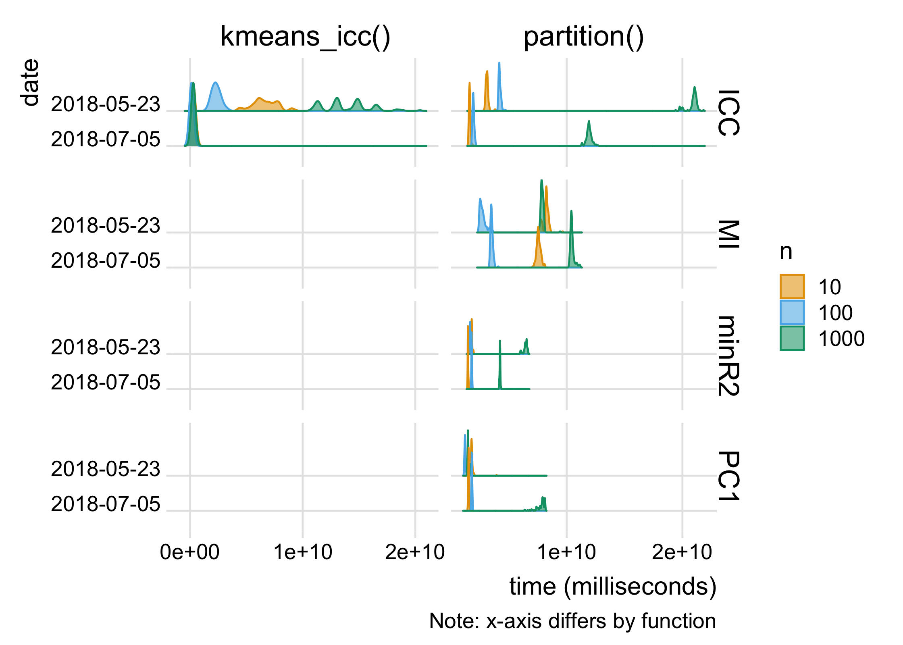

<!-- README.md is generated from README.Rmd. Please edit that file -->

# partition.benchmark

The goal of `partition.benchmark` is to benchmark the `partition`
package. It contains four benchmarking functions: `benchmark_kmeans()`,
`benchmark_partition()`, `benchmark_all()`, and `benchmark_and_save()`.
The first two benchmark the functions directly, while the third
benchmarks both and returns a combined dataframe, and the fourth calls
`benchmark_all()` and saves the data internally as `benchmarks`.

You can plot them with `plot_benchmarks()`. The default is to plot
`benchmarks`, but you can use a different data set or filter
`benchmarks`.

``` r
library(partition.benchmark)
plot_benchmarks()
```


